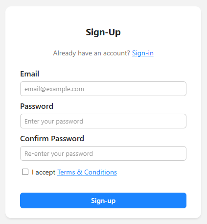
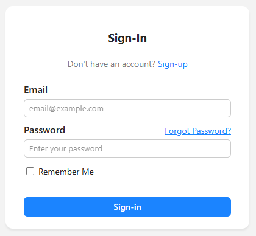
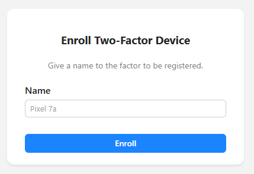
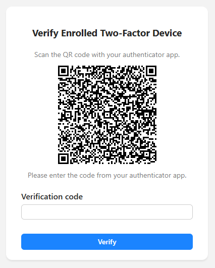
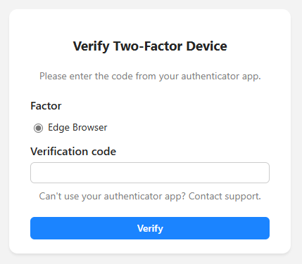
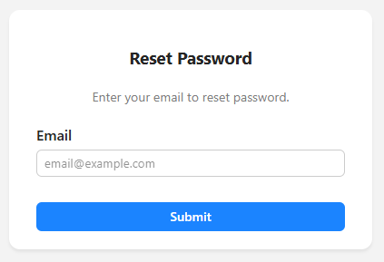
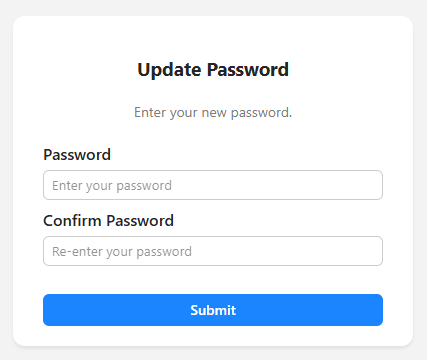

# python-flask-devcontainers
This repository is a template project for a server-side rendered web application using Python, Flask, and Supabase.  
It is built on [Visual Studio Code Dev Containers](https://code.visualstudio.com/docs/devcontainers/containers), making it easy to standardize the development environment across a team.  

## Features
This template has the following features:

- Flask-based server-side rendered web application
- Supabase user authentication and two-factor authentication
- Supabase user registration and two-factor authentication registration
- Supabase user password reset
- Custom stylesheet similar to Tailwind CSS and Bootstrap CSS

Using the following modules:

- **Python 3.12**
- **Flask:** A lightweight wep application framework.
- **Flask-Babel:** An extension to Flask that adds internationalization (i18n) support.
- **Flask-Session:** Provides support for server-side sessions.
- **Flask-SQLAlchemy:** A SQL toolkit and Object-Relational Mapper (ORM).
- **Flask-WTF:** A flexible library for form validation and rendering.
- **Gunicorn:** An HTTP server for WSGI applications, ideal for running in Docker environments.
- **pytest:** A popular testing framework for Python.
- **Python Dotenv:** A library for loading environment variables from a .env file.
- **python-inject:** A fast and simple Dependency Injection library.
- **PyYAML:** A library for parsing and writing YAML files.
- **Supabase:** A Backend-as-a-Service (BaaS) platform, serving as an alternative to Firebase.

## Prerequisites
- Windows 10 64-bit or Windows 11 64-bit.
- Enable hardware virtualization in BIOS.
- Install Windows Terminal.
- Install [WSL](https://learn.microsoft.com/en-us/windows/wsl/install) and set up a user name and password for your Linux distribution running in WSL 2.
    - Install [Docker Engine](https://docs.docker.com/engine/install/ubuntu/#install-using-the-convenience-script) on Linux (WSL 2).
    - Add current user into `docker` group: `sudo usermod -aG docker $USER`
- Install the VS Code.
    - Turn on `Dev Containers: Execute In WSL` in Preference -> Settings.
- Install the VS Code WSL extension.
- Install the VS Code Dev Containers extension.
- Install the VS Code Docker extension.

## Supabase configuraion

This web application uses Supabase for authentication. You need to configure Supabase as follows:

- Change the `Site URL` to `http://127.0.0.1:5000`.
- In `Email Templates` > `Reset Password`, change `{{ .ConfirmationURL }}` to `{{ .SiteURL }}/update-password?token_hash={{ .TokenHash }}`.

**Note:** The default Supabase email templates are set up for SPAs (Single Page Applications), so you need to modify them for SSR (Server-Side Rendering).

**Note:** If you are self-hosting Supabase, please adjust the corresponding settings accordingly. For reference, see: [Supabase Auth Configuration](https://github.com/supabase/auth?tab=readme-ov-file#configuration).

## Develop
To run this template, you will need the Supabase URL and KEY.  
Please create a .env file following the instructions in config.yaml.  

- Open the `src` folder in Visual Studio Code.
- Use Command Palette (F1) and select `Dev Containers: Reopen in Container`.
- Start debugging by pressing the `F5` key.

## Build
Access WSL through your terminal, navigate to the src folder as your working directory, and execute the following command:
```bash
docker build --tag python-flask-devcontainers .
```

## Run
Access WSL through your terminal, navigate to the src folder as your working directory, and execute the following command:
```bash
docker run -p 80:8000 -it --rm python-flask-devcontainers
```
**Note:** Ensure that port 80 on your host is available or change it to an available port.

## Screenshots

Sign-Up  


Sign-In  


Enroll Two-Factor Device  


Verify Enrolled Two-Factor Device  


Verify Two-Factor Device  


Reset Password  


Update Password  
